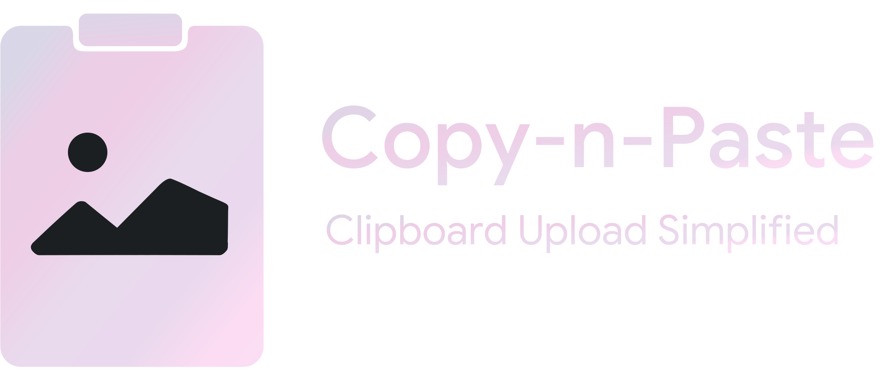

    
    
    

    

Copy-n-Paste: Clipboard Upload Simplified is a lightweight Chromium extension to simplify uploading images and files from your clipboard directly to webpages, eliminating the prior need to save them as files. This feature is well-known in Opera as Easy Files.

 

  

## ❓ How to use
1. Copy images/files OR take a screenshot
2. Click on the website's attach/upload file button (or similar)
3. Extension overlay pops up to preview and attach from clipboard
  

## 🚀 Features
- **Lightweight** – Less than 0.02MB!
- **Clean & Simple GUI** – 1 interface only!
- **Screenshot upload** – Simply snap and upload!
- **Copy and paste** – Copy images online!
- **Drag and drop** – Drag files directly from your computer!
- **Wide cross-site compatibility** – Works on popular websites (Facebook, Instagram, Twitter, YouTube, and more)!
  

## Compatibility
| Browser | Compatible? |
| :------ | :---------: |
|  Firefox  | **✓** |
|  Chrome  | **✓** |
|  Edge  | **✓** |
|  Brave  | **✓** |
|  Vivaldi  | **✓** |
|  Opera  | **?** |

_Legend: **✓** Compatible, **⨉** Not compatible, **?** Untested_
  

## Getting Started (for  Chromium developers/testers)
1. Download and extract source code
2. Visit the Extensions page
    -  `chrome://extensions`
    -  `edge://extensions`
3. Enable 'Developer mode'
4. Select 'Load unpacked'
5. Select the extracted extension folder

## Getting Started (for  Gecko developers/testers)
1. Download and extract source code
2. Visit the Debugging page
    -  `about:debugging#/runtime/this-firefox`
3. Select 'Load Temporary Add-on...'
4. Select the extracted extension folder
  

## Bugs and Feature requests
Please first check for [existing and closed issues](https://github.com/kazcfz/Paste-Image-Uploader/issues?q=is%3Aissue). 
If it's new, please [create a new issue](https://github.com/kazcfz/Paste-Image-Uploader/issues/new/choose).
